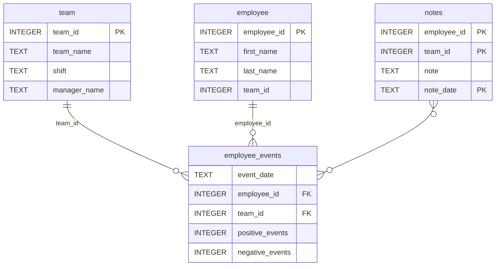

# Project: Data Science Dashboard

This repository contains code for the **Data Science Dashboard** project. The dashboard that allows managers to monitor an employee's performance and their predicted risk of recruitment. The dashboard visualizes the productivity of a single employee or a team of employees. It also displays an employee's likelihood of recruitment, or a team of employees' average likelihood of recruitment.

### Installation Instructions
1. The requirements.txt file in the project root directory contains libraries needed for this project. Create a virtual environment and install them.
2. To install the employee_events package, navigate to the python-package folder, then run python setup.py sdist bdist_wheel. This will create a dist folder containing a .tar.gz and .whl file. 
3. next, run pip install dist/employee_events-0.0-py3-none-any.whl
4. the employee_events package should now be installed.
5. To display the dashboard, run report/dashboard.py and click on http://0.0.0.0:5001

### Output


### Repository Structure
```
├── README.md
├── assets
│   ├── model.pkl
│   └── report.css
├── env
├── python-package
│   ├── employee_events
│   │   ├── __init__.py
│   │   ├── employee.py
│   │   ├── employee_events.db
│   │   ├── query_base.py
│   │   ├── sql_execution.py
│   │   └── team.py
│   ├── requirements.txt
│   ├── setup.py
├── report
│   ├── base_components
│   │   ├── __init__.py
│   │   ├── base_component.py
│   │   ├── data_table.py
│   │   ├── dropdown.py
│   │   ├── matplotlib_viz.py
│   │   └── radio.py
│   ├── combined_components
│   │   ├── __init__.py
│   │   ├── combined_component.py
│   │   └── form_group.py
│   ├── dashboard.py
│   └── utils.py
├── requirements.txt
├── start
├── tests
    └── test_employee_events.py
```

### employee_events.db


### Credits
1. Udacity Software Engineering Module
2. Kikelomo Obayemi
